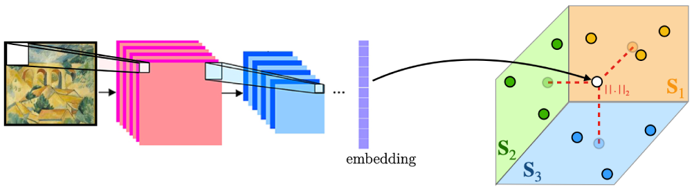

# Regression Networks for Meta-Learning Few-Shot Classification

This repository contains the reference source code for our paper [Regression Networks for Meta-Learning Few-Shot Classification](https://arxiv.org/abs/1905.13613).

Part of this work has been presented at the [ICML 2020 Workshop on Automated Machine Learning](https://sites.google.com/view/automl2020/home).



## Citation
If you find our code/paper useful, please consider citing our work using the bibtex:
```
@article{devos2020RegressionNet,
    title="{Regression Networks for Meta-Learning Few-Shot Classification}",
    author={Arnout Devos and Matthias Grossglauser},
    journal={7th ICML Workshop on Automated Machine Learning},
    year={2020}
}
```

## Enviroment
 - Python == 3.6.10
 - [PyTorch](http://pytorch.org/) == 1.5.1

## Getting started

Make sure that, after downloading a dataset as instucted below, you set `data_dir['DATASETNAME']` in `configs.py` to the folder path.

### mini-ImageNet
* Change directory to `./filelists/miniImagenet`
* run `source ./download_miniImagenet.sh` 

(WARNING: This would download the 155GB ImageNet dataset. You can comment out lines 5-6 in `download_miniImagenet.sh` if you already have this dataset.)

### CUB
* Change directory to `./filelists/CUB`
* run `source ./download_CUB.sh`

### mini-ImageNet -> CUB (cross)
* Finish preparation for CUB and mini-ImageNet and you are done! 

## Train
Run
```python ./train.py --dataset [DATASETNAME] --model [BACKBONENAME] --method [METHODNAME] [--OPTIONARG]```

For example, run `python ./train.py --dataset miniImagenet --model Conv4 --method regressionnet --train_aug --lamb 0.01`  
Commands below follow this example, and please refer to `io_utils.py` for additional options.

## Save features
Save the extracted feature before the classifaction layer to increase test speed. This is not applicable to MAML, but is required for other methods.
Run
```python ./save_features.py --dataset miniImagenet --model Conv4 --method regressionnet --train_aug --train_n_shot 5 --test_n_shot 5```

## Test
Run
```python ./test.py --dataset miniImagenet --model Conv4 --method regressionnet --train_aug --train_n_shot 5 --test_n_shot 5```

## Results
* The test results will be recorded in `./record/results.txt`

## References
This testbed builds mostly upon the repository below.

A Closer Look at Few-shot Classification:  
https://github.com/wyharveychen/CloserLookFewShot